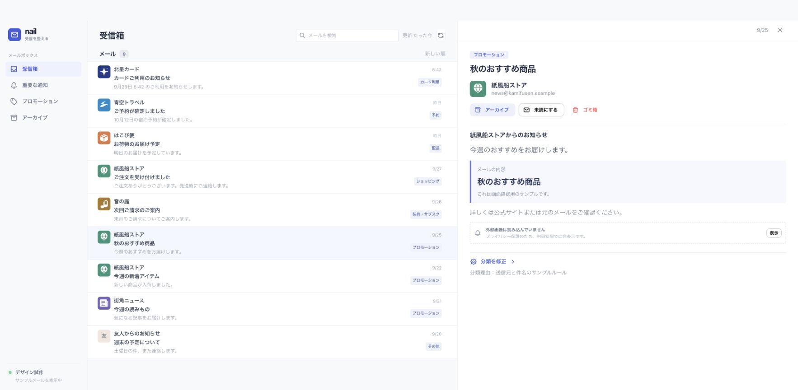

# nail

Gmail のメールを読み、整理する個人用 Web メーラー。React + Mantine の画面と Hono API を Cloudflare Workers で動かし、Gmail API に接続しています。



## できること

- 受信箱の同期、Gmail の検索構文による検索、アーカイブ一覧、メール本文の表示
- 既読・未読、アーカイブ、ゴミ箱への移動を Gmail に反映
- カード利用・配送・ショッピング・契約やサブスク・予約の5カテゴリにルールで分類
- プロモーションを送信元ごとにまとめて表示・一括操作
- メール単位の分類修正と、今後のメールに適用する送信元・件名ルール

送信・返信機能、Workers AI による分類は未実装です。

## 構成とデータ

Cloudflare Workers が画面と API を配信し、D1 に暗号化した Google 更新トークン、セッション、メールのメタデータ、分類修正・送信元ルールを保存します。メール本文は開いたときに Gmail API から取得し、D1 には保存しません。メール API の利用は所有者のセッションに制限しています。

OAuth 認証情報、ローカルの同期データ・分類ファイル、ビルド成果物は Git の管理対象から除外しています。

## 開発

Node.js 26 を使用します。

```sh
npm ci
npm run dev
```

ローカルで Gmail に接続するには、事前に OAuth クライアントの設定が必要です。[開発・ビルド・デプロイの手順](docs/development-guide.md)と[ローカル認証の設定](docs/local-gmail.md)を参照してください。

| ディレクトリ | 内容 |
| --- | --- |
| `src/client/` | React + Mantine の画面 |
| `src/worker/` | Cloudflare Workers の本番 API |
| `src/local/` | ローカル開発用 API・OAuth・ファイル保存 |
| `src/gmail/` | 共通の Gmail API クライアント・同期処理 |
| `scripts/` | 開発サーバー起動・ローカル認証・同期コマンド |
| `migrations/` | D1 のスキーマ |
| `public/` | 静的アセット |
| `docs/` | 設計メモ、決定記録、画面サンプル |

[設計ドキュメント](docs/README.md)には初期案や未実装の構想も含まれます。現在の実装・実行方法はこの README と [docs/development-guide.md](docs/development-guide.md)を参照してください。
