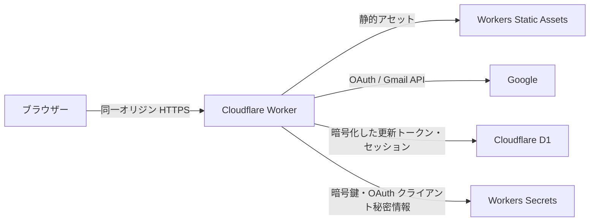

# 構成とデータの扱い

## 基本構成（暫定）

技術構成は Cloudflare Workers + Hono + React。React で画面を作り、Hono が同一オリジンの `/api/*` を担当する。単一 Worker が Vite でビルドした静的ファイルと API を Workers Static Assets で提供する。[Cloudflare の Hono + React 構成ガイド](https://developers.cloudflare.com/workers/framework-guides/web-apps/more-web-frameworks/hono/)

メール本文・添付と Gmail ラベルの正本は Gmail。本文表示と全文検索は Gmail API を使い、Cloudflare 上に本文と添付を保存しない。D1 は認証・セッション、独自の分類ルール・修正情報、送信元スタック用の最小限のメタデータ索引に使う。詳細は [整理モデル](organization.md) を参照。画像や添付の永続キャッシュ、R2、KV、通知基盤は最初は導入しない。[Workers Static Assets](https://developers.cloudflare.com/workers/static-assets/) は Worker と静的アセットを一緒にデプロイできる。

## Gmail との接続

- Google OAuth 2.0 のサーバー側認可コードフローを使う。`state` と PKCE を検証し、`offline` アクセスの更新トークンを Worker 側で保管する。ブラウザーには Gmail のアクセストークン・更新トークンを渡さない。[Google のサーバー側認可ガイド](https://developers.google.com/workspace/gmail/api/auth/web-server)
- 最初は `openid email` と `gmail.modify` を候補スコープとする。既読・アーカイブなどのラベル変更とゴミ箱への移動に `gmail.modify` が必要で、このスコープには Google 側の仕様として作成・送信権限も含まれる。アプリには送信・返信・下書き作成の機能や API を実装しない。実装時に各 API メソッドとの対応を確定し、不要なスコープを要求しない。[Gmail スコープ一覧](https://developers.google.com/workspace/gmail/api/auth/scopes) / [ゴミ箱移動の必要スコープ](https://developers.google.com/workspace/gmail/api/reference/rest/v1/users.messages/trash)
- 接続を許す Google アカウントの `sub` を設定で固定する。初回の所有者登録は公開エンドポイントから自由に実行できない形で行う。メールアドレス文字列だけを本人確認に使わない。
- 1通ごとの受信一覧と検索は `messages.list` を基本とし、一覧用の件名・差出人・日時は `messages.get?format=METADATA` で取得する。詳細は対象メッセージを取得し、会話が続いていれば `threads.get` で同じスレッドをたどれるようにする。必要な API 呼び出し数を実装時に測定する。[messages.list](https://developers.google.com/workspace/gmail/api/reference/rest/v1/users.messages/list)
- 送信元スタックと分類はメッセージ単位で扱う。受信箱の `messages.list` と `messages.get?format=METADATA` で最小限の索引を作り、`history.list` で更新する。索引が古くなった場合は受信箱を再同期する。[同期ガイド](https://developers.google.com/workspace/gmail/api/guides/sync)
- 画面を開いている間は定期的に新着を確認し、手動更新ボタンも設ける。タブが非表示のときは定期確認を止め、再表示時に更新する。具体的な間隔は Gmail API 使用量を測って決める。画面を閉じている間の通知は初期版の対象外。バックグラウンド通知を追加する場合は Google Cloud Pub/Sub と `watch` の定期更新が必要になる。[プッシュ通知ガイド](https://developers.google.com/workspace/gmail/api/guides/push)

Workers AI による分類は検討中。導入する場合も Hono の Worker 側から呼び出し、ブラウザーにモデル用の認証情報を渡さない。利用者は送るならメール本文全体を使う方向を希望している。分類のために取得した本文を永続保存・記録せず、添付ファイルは AI に送らない。失敗してもメールの閲覧・整理を続けられるようにする。詳細は [整理モデル](organization.md#workers-ai-による分類検討中) を参照。

## 認証情報と Web セキュリティ

- Google の更新トークンはアプリケーション側で AES-GCM 暗号化して D1 に保存し、鍵は Workers Secrets に置く。鍵にバージョンを持たせてローテーションできる形にする。OAuth クライアントシークレットも Workers Secrets に置く。
- Web セッションはランダムな ID を `HttpOnly; Secure; SameSite=Lax` Cookie に入れ、D1 にはそのハッシュと有効期限だけを保存する。ログアウト時にセッションを無効化する。
- 書き込み API は `Origin` 検証と CSRF 対策を行う。API 応答は `Cache-Control: no-store` とし、ログには本文、宛先、認証情報を出さない。
- 初期版から HTML メールを表示する。サニタイズ、危険な URL の除去、外部画像の初期ブロック、CSP を実装前に具体化して検証する。プレーンテキスト表示でも URL の自動リンク化は慎重に扱う。
- 添付は Worker 経由で認可して取得する。大きなデータを Worker のメモリに全量読み込まない設計にし、サイズ上限と失敗時の動作を実装時に決める。[Workers の制限](https://developers.cloudflare.com/workers/platform/limits/)

## OAuth の公開状態

Google は個人用アプリを OAuth 検証の例外としているが、未検証アプリの警告と利用者数制限はありうる。[個人利用の例外](https://developers.google.com/identity/protocols/oauth2/production-readiness/sensitive-scope-verification) `External / Testing` のまま Gmail スコープを要求すると更新トークンが 7 日で期限切れになるため、常用前に適切な公開状態を確認する。[Google OAuth 2.0](https://developers.google.com/identity/protocols/oauth2)

## 運用上の境界

- Google 側の障害・API 制限・OAuth 失効時には利用できない。障害画面に原因と再接続手段を表示する。
- API の 429 / 5xx は指数バックオフで処理する。読み込み要求と既読・アーカイブなどの操作は、それぞれの再試行時に現在の状態を確認し、失敗を成功と誤表示しない。[Gmail API のエラー処理](https://developers.google.com/workspace/gmail/api/guides/handle-errors)
- 現在の Gmail API には利用量上限があり、料金方針も変化しうる。デプロイ前に最新の割当と課金条件を確認する。[Gmail API の使用量制限](https://developers.google.com/workspace/gmail/api/reference/quota)
